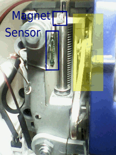

Sew machine
===========

2014-03-04
Controls a mini sew machine (janome mini and clones): 
- [ ]Needle always up;
- [ ]Needle always down;
- [ ]Needle follows pedal;
- [ ]Needle single shot;





```
Using ATtiny2313.
PD0: foot pedal : ----./ .---GND (red button)
PD6: buzzer
PD5: Magnetic sensor: ---10K---./ .---GND  (greeen button)
PB2: pwm motor control

```
